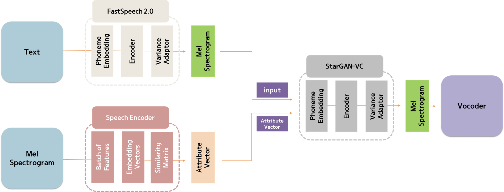
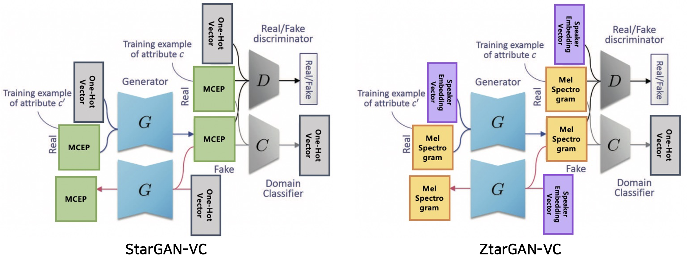

# ZeroShot StarGAN-VC

#### Framework

#### ZtarGAN-VC

Zero Shot Learning을 수행할 수 있는 StaGAN-VC 제안

1. StarGAN-VC의 attribute vector를 Embedding Vector(Speaker Encoder 활용)로 대체함으로써 Zero Shot Learning 수행
2. Embedding Vector를 attribute vector로 활용할 수 있도록 Domain Classifier 수정
3. Embedding Vector를 attribute vector롤 활용함으로써 소리의 고유한 특징을 반영한다. 따라서 MCEP가 아닌 Mel Spectrogram을 input으로 사용해 정보 손실을 방지하며 소리의 고유한 특징 반영 가능
